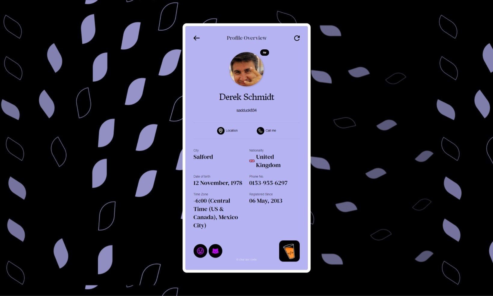
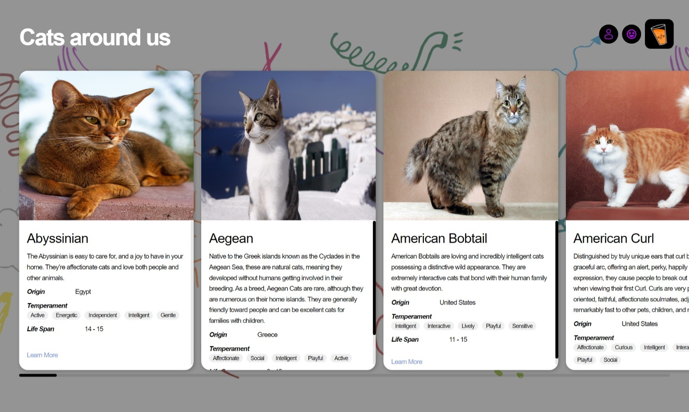

# Project Title

**Machine Coding Round - 2 (React.js)**

## Table of Contents

- [Introduction](#introduction)
- [Links](#links)
- [Features](#features)
- [Technologies Used](#technologies-used)
- [Setup Instructions](#setup-instructions)
- [Pages Overview](#pages-overview)
  - [RandomUser](#randomuser)
  - [RandomJokes](#randomjokes)
  - [CatsListing](#catslisting)
- [Project Structure](#project-structure)
- [Additional Notes](#additional-notes)

## Introduction

This project is a submission for the 'Machine Coding Round - 2 (React.js)' assignment on the [Masterji](https://masterji.co/) platform. It is a React application built using Vite, featuring three distinct pages that demonstrate different data fetching techniques, including infinite scrolling.

## Links

- [GitHub Repo](https://github.com/NiloyDas07/MasterjiAssignmentMachineCodingRound2/)
- [Live Website](https://niloysd07-masterji-assignment-machine-coding-round2.vercel.app/)

## Features

- **Random User Information**: Fetch and display random user data.
- **Random Jokes**: Fetch and display random jokes.
- **Cat Listings**: Fetch and display cat data with infinite scrolling.

## Technologies Used

- [React](https://react.dev/) with [Vite](https://vitejs.dev/)
- [React Router](https://reactrouter.com) for routing
- [Axios](https://axios-http.com/docs/intro) for API communication
- [Tailwind CSS](https://tailwindcss.com) for styling
- [libphonenumber-js](https://github.com/mike-marcus/libphonenumber-js) for phone number formatting
- [react-world-flags](https://github.com/smucode/react-world-flags#readme) for country flags

## Setup Instructions

To set up and run this project locally, follow these steps:

1. **Clone the repository**:

   ```bash
   git clone <repository-url>
   cd <repository-directory>
   ```

2. **Install dependencies**:

   ```bash
   npm install
   ```

3. **Start the development server**:
   ```bash
   npm run dev
   ```

## Pages Overview

### RandomUser

This page fetches and displays random user details using the API:
`https://api.freeapi.app/api/v1/public/randomusers/user/random`.

**Screenshots**:



**Features**:

- Displays user details like name, username, and contact information.
- Includes a reload button to fetch a new random user.
- Uses skeleton components to display loading state.

### RandomJokes

This page fetches and displays random jokes using the API:
`https://api.freeapi.app/api/v1/public/randomjokes/joke/random`.

**Screenshots**:


**Features**:

- Displays a random joke.
- Fetches a new joke when the page is reloaded.
- All the analytics are randomly generated every time.
- Includes error handling with a friendly message when the joke fails to load.

### CatsListing

This page fetches and displays different types of cats using the API:
`https://api.freeapi.app/api/v1/public/cats?page=1&limit=4`.

**Screenshots**:



**Features**:

- Implements infinite scrolling to load more cats as you scroll horizontally.
- Uses a debounce function to prevent unnecessary or too many API calls.

## Project Structure

Here's a brief overview of the project structure:

```css
src/
├── assets/
├── components/
│   ├── RandomUser/        # Directory containing components related to RandomUser.jsx page.
│
│   ├── RandomJokes/       # Directory containing components related to RandomJokes.jsx page.
│
│   ├── CatsListing/       # Directory containing components related to CatsListing.jsx page.
│   └── ...                # Other global components.
├── pages/
│   ├── RandomUser.jsx     # RandomUser page component
│   ├── RandomJokes.jsx    # RandomJokes page component.
│   ├── CatsListing.jsx    # CatsListing page component.
│
├── App.jsx                # Main App component
├── main.jsx               # Main entry point of the application. All routes defined here.
├── index.css
└── ...                    # Other files and directories.
```

## Additional Notes

- I added a couple buttons which link to the other pages on every page to facilitate easy navigation between the pages.

- In the `cat-listing` page, I designed the cards so that they always fit the viewport. The overflowing cards were just looking bad especially on smaller screens. This led to the addition of a scrollbar in the cards for smaller screens.

- No mobile designs were provided so I just put some personal touches on the design, eg: relocating the ChaiCode image etc.

- I could not find the wavy flags given in the design for `random-user`, so I just used a normal one.
